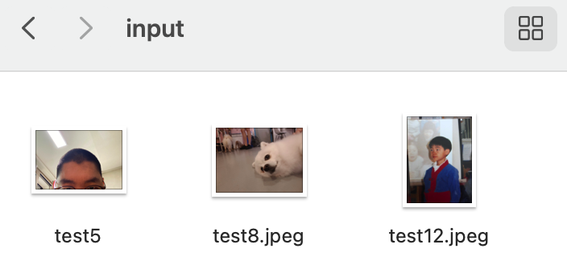
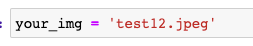
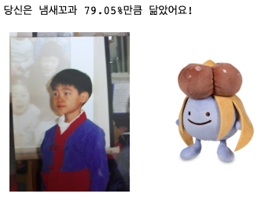
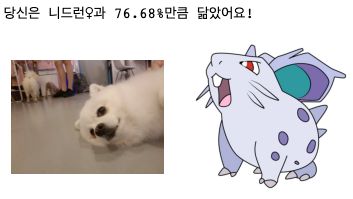
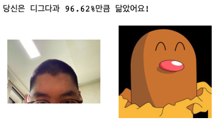
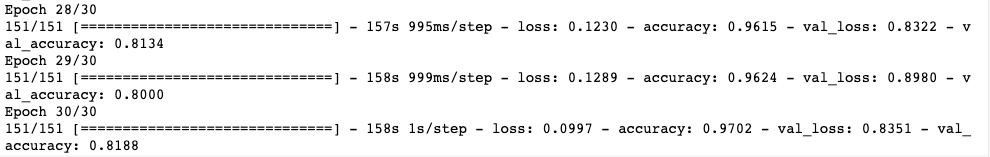
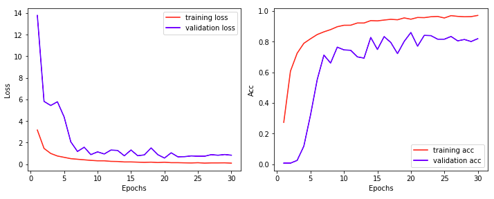
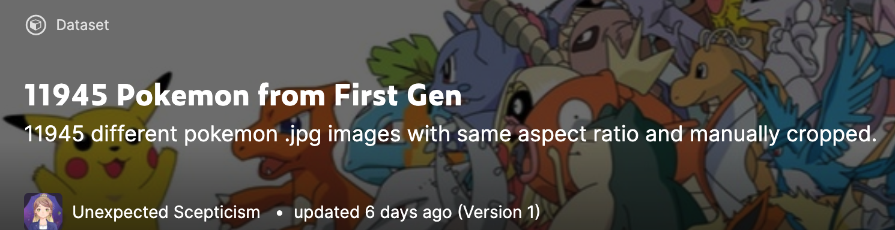

# What Pokemon Are You Similar To?

## Contents

1. [Title](#Title)
2. [Description](#Description)
3. [Example](#Example)
4. [Model](#Model)

## Title

### 당신은 어떤 포켓몬과 닮았나요?

## Description

* 사진을 넣으면 1세대 포켓몬 151마리 중 어떤 포켓몬과 제일 닮았는지를 알려주는 프로젝트입니다.

### 사용법

1. [이곳](https://www.kaggle.com/unexpectedscepticism/11945-pokemon-from-first-gen)에서 데이터를 받은 후 이 프로젝트의 루트 디렉토리에 저장합니다.

2. split_data.ipynb를 실행시켜 데이터를 나눕니다.

3. 본인이 원하는 사진을 input 파일에 넣습니다.

4. what_pokemon_are_you_similar_to.ipynb 에 들어간 후 your_img 변수에 추가한 이미지의 이름을 입력합니다.

5. 그 후 모든 cell을 실행시킨 후 마지막으로 what_pokemon_are_you_similar_to 함수를 실행시켜 결과를 확인합니다.

### Example

## Model

* kaggle에서 제공하는 포켓몬 사진 11945장을 CNN을 이용해 학습을 시킨 모델을 이용하였습니다.
* 사용한 CNN 모델로는 keras에서 제공하는 ResNet50을 사용하였습니다.

* 여러 모델을 돌린 결과, 최종 모델은 위와 같은 loss, accuracy를 보였습니다.
* 마지막 test set에 대해서 최종 accuracy는 85.62%가 나왔습니다.

* [데이터 출처](https://www.kaggle.com/unexpectedscepticism/11945-pokemon-from-first-gen)

## Requirement

python==3.7

tensorflow==2.7.0

numpy==1.21.2

h5py==2.10.0

matplotlib==3.5.0

import_ipynb=0.1.3

_**python, tensorflow, h5py의 버전이 다를 경우 모델이 실행되지 않을 수 있습니다.**_
